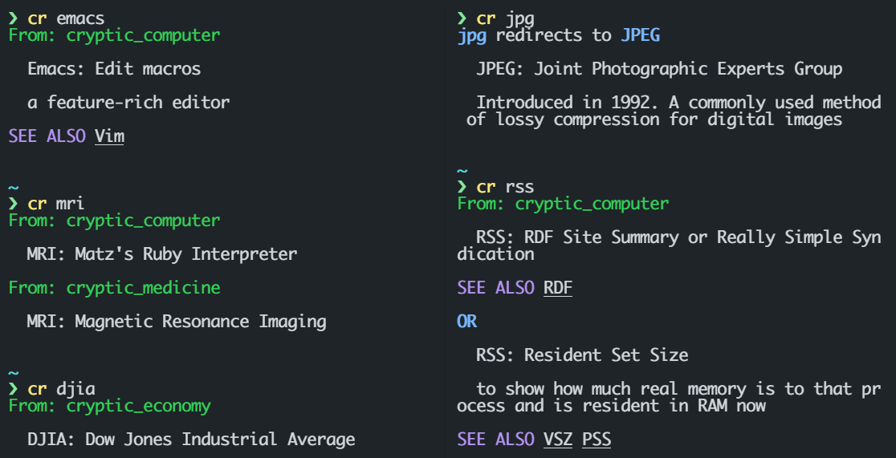

<div align="center">

**Cryptic Resolver**

<<<<<<< HEAD
[][cryptic_computer]
=======
[][cryptic_computer]
>>>>>>> 0695ae94570f9da8cbb58419f353242cf6bf730e
[](https://rubygems.org/gems/cryptic-resolver) 
 


</div>

This command line tool `cr` is used to **record and explain cryptic commands, acronyms and so forth** in daily life.
The effort is to study etymology and know of naming conventions.

Not only can it be used in computer filed via our default sheet [cryptic_computer], but also you can use this to manage your own knowledge base easily.

<<<<<<< HEAD
- Currently we have **197** keywords explained in our default sheet.
=======
- Currently we have **170** keywords explained in our default sheet.
>>>>>>> 0695ae94570f9da8cbb58419f353242cf6bf730e

<br>

## Install

```bash
gem install cryptic-resolver
```

Tested well on `Ubuntu` and `Windows 11`.

<br>

## Why

The aim of this project is to:

1. make cryptic things clear
2. help maintain your own personal knwoledge base

rather than

1. record the use of a command, for this you can refer to [tldr], [cheat] and so on. 

<br>

# Usage

```bash
$ cr a_com_d
# -> It means A COMmanD 

$ cr -u 
# -> update all sheets

$ cr -u https://github.com/ccmywish/ruby_things.git
# -> Add your own knowledge base! 

$ cr -h
# -> show help
```


<br>

# Implementation

cr is written in pure **Ruby**. You can implement this tool in any other langauge you like(name your projects as `cr_python` for example), just remember to reuse our [cryptic_computer] or other sheets which are the core parts anyone can contribute to.

## Sheet layout

Every sheet should be a git repository. And each should contain these files(we call these dictionarys):

1. 0123456789.toml
2. a.toml
3. b.toml
3. ...
4. z.toml

## File format

In every file(or dictionary), your definition format looks like this in pure **toml**:
```toml
# a normal definition
# notice that we want to keep the key case unsenstive
# because the case sometimes contains  details to help we understand
[XDG]
desc = "Cross Desktop Group"

# If you want to explain more, use 'full'
[xxd]
desc = "hex file dump"
full = "Why call this 'xxd' rather than 'xd'?? Maybe a historical reason"

# if there are multiple meanings, you should add a subkey to differ
[XDM.Download]
desc = "eXtreme Download Manager"

[XDM.Display]
desc = "X Display Manager"
```

We have more features than above
```toml
[JPEG]
desc = "Joint Photographic Experts Group"
full = "Introduced in 1992. A commonly used method of lossy compression for digital images"

[JPG]
same = "JPEG" # Yes, we just need to redirect this. No duplicate!
see = ['MPG','PNG'] # Yes, this is a `see also`

["H.265"]
desc = "A video compression standard" # The 'dot' keyword supported using quoted strings

```

## Name collision

In one sheet, you should consider adding a subkey to differ each other like the example above.

*But what if a sheet has 'gdm' while another also has a 'GDM'?*

> That's nothing, because cr knows this.

*But what if a sheet has two 'gdm'?* 

> This will lead to toml's parser library fail. So you hace these solutions
> 1. Use a better lint for example: [VSCode's Even Better TOML](https://github.com/tamasfe/taplo)
> 2. Watch the fail message, you may notice 'override path xxx', the xxx is the collision, you may correct it back mannually.


<br>

## cr in Ruby development

maybe you need `sudo` access

- `gem build cryptic-resolver`
- `gem install cryptic-resolver -l`
- `gem uninstall cryptic-resolver`
- `gem update cryptic-resolver (--pre)`

<br>

# LICENSE
cr is under MIT

[cryptic_computer] is under CC-BY-4.0


[cryptic_computer]: https://github.com/cryptic-resolver/cryptic_computer
[tldr]: https://github.com/tldr-pages/tldr
[cheat]: https://github.com/cheat/cheat
